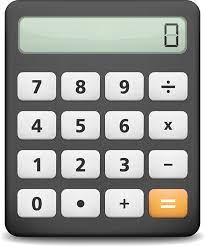

Как стигнахме до _тук_
======================

[//]: # (It all started with comfort & safety which requires ... labour)
Търсейки повече комфорт и сигурност сме намерили ... _работата_
---------------------------------------------------------------
Умният (или може би мързелив) Човек често си задава въпроси като:
+ Как мога да си улесня живота?
+ Как мога да си спестя нуждата да върша тази (не-вълнуваща/non-rewarding) работа отново и отново?
+ Ако не мога напълно да си я спестя, то поне как мога да я да върша по-бързо, с по-малко усилия и по-прецизно, т.е. с по-малко грешки?

И горното важи за всички видове 'работата' в човешкия живот, като се започне от работа на нивата, където комбайна и немуподобните се използват за тази цел:

... и се стигне до компютрите и тяхното 'програмното обезпечаване', което е предмета на нашата среща днес и в предстоящите седмици.

[//]: # (TODO: competing with Nature vs. competing with other humans, e.g. wars & weapons)
[//]: # (Early computers were not anywhere close to what we now think a computer is)

Ранните компютри нямат много общо със сегашната ни представа за компютър
------------------------------------------------------------------------
Британският учен [Чарлз Бабидж][10] днес е считан за 'баща' на компютъра:
> Charles Babbage (/ˈbæbɪdʒ/; 1791 – 1871) was an English polymath.
> A mathematician, philosopher, inventor and mechanical engineer,
> Babbage originated the concept of a digital programmable computer.

Докато лейди [Ада Лъвлейс][20] - за първия програмист:
> Augusta Ada King, Countess of Lovelace (1815 – 1852)
> was an English mathematician and writer,
> chiefly known for her work on Charles Babbage's proposed
> mechanical general-purpose computer, the Analytical Engine.
> She was the first to recognise that the machine had applications
> beyond pure calculation, and to have published
> the first algorithm intended to be carried out by such a machine.
> As a result, **she is often regarded as the first computer programmer**.

и понеже в момента нямаме време за историческа ретроспекция, ще прескочим от 'компютъра' на Чарлс Бабидж и програмите на лейди Ада Лъвлейс направо на [електронния джобен калкулатор][30] появил се някъде в 70те години на 20ти век.

Може би не си давате сметка, но това е бил един от първите масово достъпни компютри.

Имаме предид простия калкулатор (долу вляво), а не само научния 'калкулатор-на-стероиди' (долу вдясно):

 <-- vs. --> 

[//]: # (Calculations - easy, **hard**, **_tedious_**)

[10]: https://cse.umn.edu/cbi/who-was-charles-babbage
[20]: https://en.wikipedia.org/wiki/Ada_Lovelace
[30]: https://en.wikipedia.org/wiki/Calculator
