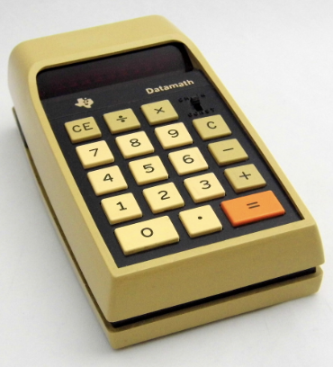
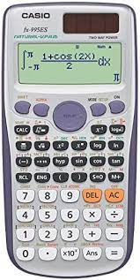

Калкулатора
===========
[Електронния джобен калкулатор][10] се появил се в началото на 70те години на 20ти век.
Може би не си давате сметка, но това всъщност е първият масово достъпен *електронен* компютър.
Да, сметалото се е появило много по-рано, то също е един вид *масово достъпен компютър*, но не е *електронен* компютър.

Говорим за простия калкулатор (вляво), а не за появилия се по-късно научен калкулатор (вдясно):

 <--- Обикновен ... Научен ---> 

|[<<](s02.md) | [>> Задачи, които се решават по-лесно с калкулатор](s04.md)|
|--|--|

<!-- Calculations - easy, **hard**, **_tedious_** -->
[10]: https://www.edn.com/ti-enters-calculator-market-september-21-1972/
[20]: http://www.datamath.org/Story/Datamath.htm
