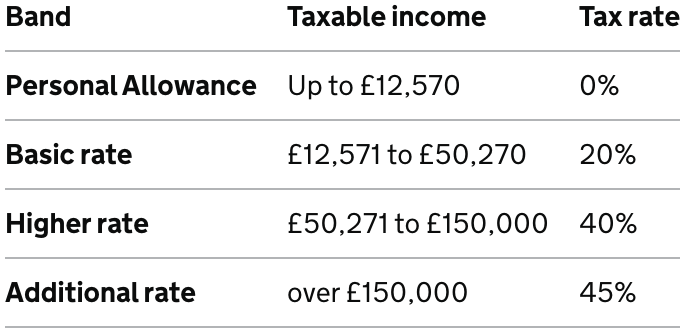

Какви задачи ни помага да решаваме простия калкулатор?
======================================================

Пресмятане на (прогресивен) данък върху доходите
------------------------------------------------

Може би знаете, в България в момента е в сила плосък данък върху доходите на ФЛ (физически лица).
Това грубо казано означава, че след като си платите осигуровките, 10% от останалата сума дължите на държавата като "данък общ доход", а останалите 90% са си за вас.
Не е твърде социално, но пък поне е лесно за смятане ...

Във Великобритания от друга страна, [този данък е *прогресивен*][10]. Какво ще рече това?
Ще рече, че колкото по-малки са ви доходите, толкова по-малка част от тях ще ви бъдат взети от държават под формата на ДОД:

Всъщност пълната схемата на ДОД в UK е малко по-сложна - например т.нар. Personal Allowance
започва да намалява при доход над 100К и стига до нула в един момент ([подробности тук][20]),
но за целите на това упражнение и така е достатъчно сложна.

Задача 1
--------
Сметнете ДОД в а) България; б) Великобритания върху доход от:
1.   X = £12К / 28K лв. (сумите са равни при курс 2.(3) лв за GBP)
2. 2*X = £24К / 56K лв.
3. 3*X = £36К / 84K лв.
4. 4*X = £48К / 112K лв.
5. 8*X = £96К / 224K лв.
6. 16*X = £192К / 448K лв.

 <!--  -->

|[<<](s03.md) | [>> Какви задачи ни помага да решаваме простия калкулатор?](s04.md)|
|--|--|

[10]: https://www.gov.uk/income-tax-rates
[20]: https://www.which.co.uk/money/tax/income-tax/tax-rates-and-allowances/

